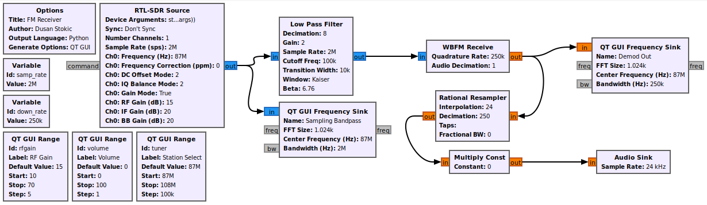

[![Downloads][downloads-shield]][downloads-url]
[![Commit-activity][commit-activity-shield]][commit-activity-url]
[![Issues][issues-shield]][issues-url]
[![Repo-size][repo-size-shield]][repo-size-url]
[![License][license-shield]][license-url]  
[![Forks][forks-shield]][forks-url]
[![LinkedIn][linkedin-shield]][linkedin-url]

# FM_Rx
RTL-SDR FM receiver with GNU Radio Companion

[release-url]: https://github.com/StokicDusan/FM_Rx/releases
[downloads-shield]: https://img.shields.io/github/downloads/StokicDusan/FM_Rx/total 
[downloads-url]: https://github.com/StokicDusan/FM_Rx/releases
[contributors-shield]: https://img.shields.io/github/contributors/StokicDusan/FM_Rx
[contributors-url]: https://github.com/StokicDusan/FM_Rx/graphs/contributors
[forks-shield]: https://img.shields.io/github/forks/StokicDusan/FM_Rx?style=social
[forks-url]: https://github.com/StokicDusan/FM_Rx/network/members
[issues-shield]: https://img.shields.io/github/issues/StokicDusan/FM_Rx
[issues-url]: https://github.com/StokicDusan/FM_Rx/issues
[commit-activity-shield]: https://img.shields.io/github/last-commit/StokicDusan/FM_Rx
[commit-activity-url]: https://github.com/StokicDusan/FM_Rx/graphs/commit-activity
[license-url]: https://github.com/StokicDusan/FM_Rx/blob/master/LICENSE
[license-shield]: https://img.shields.io/github/license/StokicDusan/FM_Rx
[repo-size-shield]: https://img.shields.io/github/repo-size/StokicDusan/FM_Rx
[repo-size-url]: https://img.shields.io/github/repo-size/StokicDusan/FM_Rx
[linkedin-shield]: https://img.shields.io/badge/LinkedIn-0077B5?style=plastice&logo=linkedin&logoColor=white
[linkedin-url]: https://linkedin.com/in/stokicdusan
